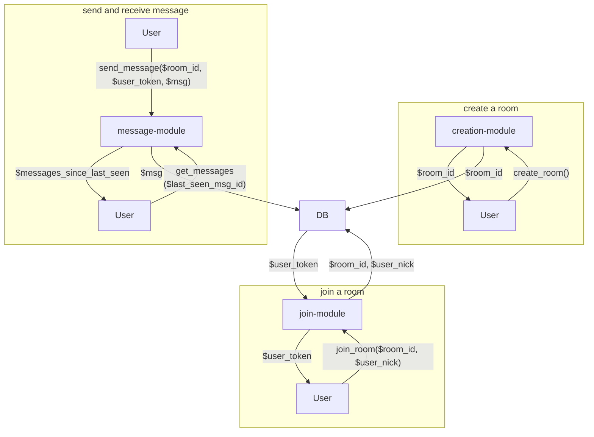

# tiny-chat

Inspired by [tinyprojects.dev](https://tinyprojects.dev/) I wanted to build a very simplified browser chat client. The goal is not to monetize anything but to double check that I am not missing any of the skills involved in doing so.

## Requirements

- Users can generate chat with unique, generated room_id
  - Persistence
    - room_id can be key and/or prefix in a key/value store
  - Cleanup
    - Delete if room idle, e.g. after 5 min
    - Maximum TTL, e.g. 12h
  - Limits
    - channels by user (requires authentication, e.g. via SSO)
- Users can join existing chat with room_id
  - Persistence
    - List of users for each room
- Users can send text to room
  - Messages needs to be ordered in some centralized data structure to avoid clients seing different versions of the chat
  - Limits
    - length of message, e.g. 1000 UTF-8 characters
- Users see chat history
  - Limits
    - max x messages in chat history

## MVP

- Restrict persistence to in-memory => only one server instance
- Limit absolute # of channels to avoid having to implement authentication for per user limit

## Basic module outline

## Implementation choices

- Simple REST endpoints for channel creation
- Chat client can communicate with server via websocket as we can leverage push and pull between client and server as frequent communication is necessary anyway.
